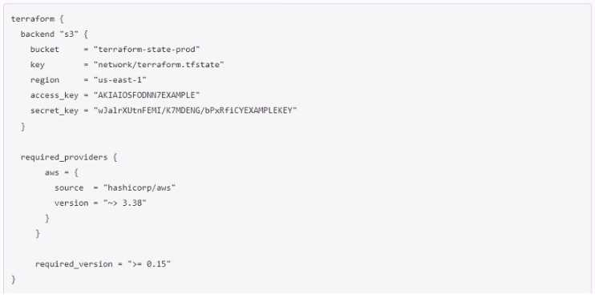

## Why does this backend configuration not follow best practices?

- [ ] An alias meta-argument should be included in backend blocks whenever possible
- [ ] You should use the local enhanced storage backend whenever possible
- [ ] You should not store credentials in Terraform configuration
- [ ] The backend configuration should contain multiple credentials so that more than one user can execute terraform plan and terraform apply
---

The backend configuration shown in the image does not follow best practices because:

- [ ] **An alias meta-argument should be included in backend blocks whenever possible**
  - This is incorrect. Aliases are typically used with providers, not backend configurations.

- [ ] **You should use the local enhanced storage backend whenever possible**
  - This is incorrect. Using a remote backend like S3 is often preferred for storing state files, especially in team environments, to ensure centralized and consistent state management.

- [x] **You should not store credentials in Terraform configuration**
  - This is the correct option. Storing sensitive information such as access keys and secret keys directly in the Terraform configuration is not a best practice. Instead, credentials should be managed securely using environment variables, a credential manager, or IAM roles.

- [ ] **The backend configuration should contain multiple credentials so that more than one user can execute terraform plan and terraform apply**
  - This is incorrect. Backend configurations should not contain multiple sets of credentials. Instead, IAM roles and policies should be used to grant necessary permissions to different users.